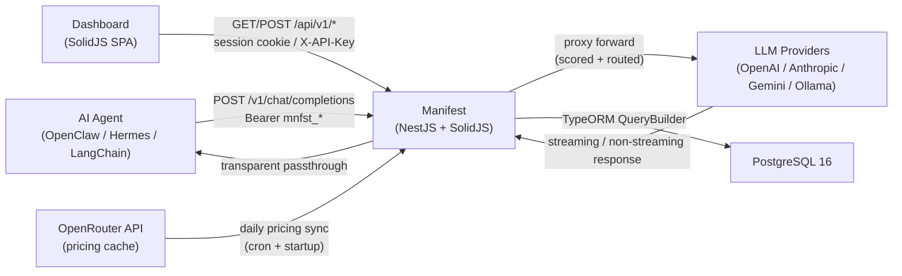
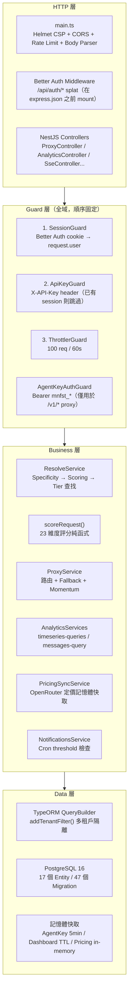
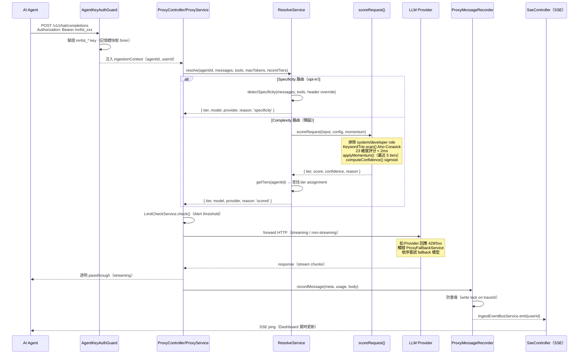

# Manifest 系統架構文件

> 最後更新：2026-04-20  
> 版本：依 `packages/manifest/package.json` 為準

---

## 1. 高層架構概覽

Manifest 是一個智慧 LLM 路由器，坐落於個人 AI Agent（如 OpenClaw、Hermes）與 LLM providers（OpenAI、Anthropic、Google 等）之間。每個請求在 2ms 內完成評分與路由，選出「最便宜但足夠勝任」的模型。



### Monorepo 結構

```
packages/
├── backend/      # NestJS 11 — API server + LLM proxy + 路由引擎
├── frontend/     # SolidJS — Dashboard SPA
├── shared/       # TypeScript 型別與常數（tiers、specificity、agent-type）
└── manifest/     # 版本 shell（僅 package.json + CHANGELOG.md）
```

---

## 2. 元件清單

| 元件 | 職責 | 關鍵檔案 | 上游依賴 | 下游依賴 |
|------|------|---------|---------|---------|
| **ProxyController** | 接收 Agent 的 `/v1/chat/completions` 請求 | `routing/proxy/proxy.controller.ts` | AgentKeyAuthGuard | ProxyService |
| **ProxyService** | 路由決策、fallback 協調、訊息記錄 | `routing/proxy/proxy.service.ts` | ResolveService, SessionMomentumService, ProxyFallbackService | ProviderClient, ProxyMessageRecorder |
| **ResolveService** | 路由解析入口：specificity → complexity scoring → tier 查找 | `routing/resolve/resolve.service.ts` | TierService, SpecificityService, scoreRequest() | ProviderKeyService |
| **scoreRequest()** | 23 維度評分核心函式（<2ms） | `scoring/index.ts` | KeywordTrie, momentum | 無（純函式） |
| **KeywordTrie** | Aho-Corasick 多模式字串搜尋（lazy singleton） | `scoring/keyword-trie.ts` | — | scoreRequest() |
| **SpecificityDetector** | 9 類任務類型偵測（keyword + tool name prefix） | `scoring/specificity-detector.ts` | keywords.ts | ResolveService |
| **SessionMomentumService** | 記憶體 Map 追蹤最近 5 個 tier，防止跟進訊息降級 | `routing/proxy/session-momentum.service.ts` | — | ProxyService |
| **ProxyFallbackService** | 依序嘗試 fallback 模型（429/5xx 觸發） | `routing/proxy/proxy-fallback.service.ts` | ProviderKeyService | ProviderClient |
| **ProviderClient** | HTTP forward 到實際 LLM provider | `routing/proxy/provider-client.ts` | provider-endpoints.ts | LLM Providers |
| **AgentKeyAuthGuard** | Bearer token（mnfst_*）驗證，5 分鐘記憶體快取 | `otlp/guards/agent-key-auth.guard.ts` | AgentApiKey entity | ProxyController |
| **SessionGuard** | Better Auth cookie session 驗證 | `auth/session.guard.ts` | auth.instance.ts | 所有 Dashboard API |
| **ApiKeyGuard** | X-API-Key header 驗證（timing-safe compare） | `common/guards/api-key.guard.ts` | ConfigService | 所有 Dashboard API |
| **PricingSyncService** | 啟動 + 每日從 OpenRouter 同步定價到記憶體 | `model-prices/pricing-sync.service.ts` | OpenRouter API | ModelPricingCacheService |
| **ModelPricingCacheService** | 提供記憶體中的定價查詢介面 | `model-prices/model-pricing-cache.service.ts` | PricingSyncService | ResolveService, TierAutoAssignService |
| **TierService** | CRUD 管理 tier assignments | `routing/routing-core/tier.service.ts` | tier_assignments entity | ResolveService |
| **ProviderKeyService** | 解密 API key（AES-256-GCM），取得有效模型 | `routing/routing-core/provider-key.service.ts` | user_providers entity | ProxyService, ResolveService |
| **IngestEventBusService** | RxJS Subject，訊息入庫後 emit 事件 | `common/services/ingest-event-bus.service.ts` | — | SseController |
| **SseController** | 將 IngestEventBus 事件以 SSE 推送到 Dashboard | `sse/sse.controller.ts` | IngestEventBusService | SolidJS Frontend |
| **DatabaseModule** | TypeORM + PostgreSQL 設定、Migration 管理 | `database/database.module.ts` | — | 所有 Entity |
| **AuthModule (Better Auth)** | email/password + Google/GitHub/Discord OAuth | `auth/auth.instance.ts` | pg.Pool | SessionGuard |
| **AnalyticsModule** | Dashboard 分析 API（overview/tokens/costs/messages/agents） | `analytics/` | 所有 entity | SolidJS Frontend |
| **NotificationsModule** | Alert 規則（threshold）+ Email 寄送（Mailgun/Resend/SMTP） | `notifications/` | LimitCheckService | Email Provider |
| **SolidJS Frontend** | Dashboard SPA（Workspace、Overview、Routing、Limits 等頁面） | `frontend/src/` | API endpoints, SSE | 瀏覽器 |

---

## 3. 分層設計說明



### 各層職責說明

| 層級 | 職責 | 關鍵設計 |
|------|------|---------|
| **HTTP 層** | 請求接收、安全標頭、Body 解析 | Better Auth 在 `express.json()` 之前 mount；Helmet 強制 CSP self-only |
| **Guard 層** | 身份驗證、速率限制 | 全域 Guard 順序不可變更；`@Public()` 跳過 Session/ApiKey；`@SkipThrottle()` 跳過限流 |
| **Business 層** | 路由決策、分析計算、通知判斷 | `scoreRequest()` 為純函式，無副作用；`addTenantFilter()` 強制多租戶隔離 |
| **Data 層** | 持久化、快取 | `synchronize: false`，所有 schema 變更必須透過 Migration；provider API key 以 AES-256-GCM 加密 |

---

## 4. 通訊模式

### 4.1 同步 API（Sync REST）

所有 Dashboard API 使用標準 HTTP REST，透過 `credentials: include` 傳遞 session cookie。

```
瀏覽器 → GET /api/v1/overview → SessionGuard → AnalyticsController → AnalyticsService → TypeORM → PostgreSQL
```

Agent 路由請求（同步）：

```
Agent → POST /v1/chat/completions → AgentKeyAuthGuard → ProxyController → ProxyService → ResolveService → scoreRequest() → LLM Provider
```

### 4.2 Streaming（SSE + HTTP Streaming）

LLM proxy 完整支援 streaming（`stream: true`）。Server-Sent Events 用於 Dashboard 實時更新：

```
LLM Provider → streaming chunks → ProxyController → passthrough → Agent
                                                   ↓（完成後）
                                        IngestEventBusService.emit()
                                                   ↓
                                        SseController → GET /api/v1/events → 瀏覽器
```

### 4.3 Cron Jobs（定時任務）

| 任務 | 執行時機 | 位置 |
|------|---------|------|
| OpenRouter 定價同步 | 啟動時 + 每日 | `database/pricing-sync.service.ts` |
| Ollama 模型同步 | 手動觸發（`POST /api/v1/routing/:agent/ollama/sync`）| `database/ollama-sync.service.ts` |
| Alert threshold 檢查 | 定期 cron（`@Cron`） | `notifications/services/limit-check.service.ts` |

---

## 5. 關鍵設計決策與 Trade-off

### 決策 1：Better Auth 在 NestJS 外初始化（Import Time Execution）

**位置**：`packages/backend/src/auth/auth.instance.ts`

`betterAuth()` 在 TypeScript **import 時**即執行，早於 NestJS `ConfigModule` 的 `.env` 載入。原因：

- Better Auth 需要在 `express.json()` **之前** mount 為 Express middleware，以便自行控制 body parsing（OAuth callback 需要原始 body）
- NestJS 全域 `bodyParser: false` 設定（`NestFactory.create(AppModule, { bodyParser: false })`）確保這個順序
- 代價：啟動時必須用 `NODE_OPTIONS='-r dotenv/config'` 預載 `.env`，否則 `process.env` 尚未有值

**Trade-off**：犧牲「NestJS DI 管理 auth 實例」的整潔性，換取正確的 middleware 順序與 Better Auth 的 raw body 控制能力。

---

### 決策 2：Scoring 排除 system / developer role

**位置**：`packages/backend/src/scoring/text-extractor.ts:32`

```typescript
const EXCLUDED_ROLES = new Set(['system', 'developer']);
```

`packages/backend/src/routing/proxy/proxy.service.ts` 中也有同樣的常數：

```typescript
const SCORING_EXCLUDED_ROLES = new Set(['system', 'developer']);
```

原因：個人 AI Agent（如 OpenClaw）在每個請求中注入大型、關鍵字豐富的 system prompt。若包含 system role，幾乎所有請求都會被評為 `reasoning` 最高 tier，讓路由失去意義。

**Trade-off**：可能漏掉 system prompt 中對複雜度有意義的指令，但換取更準確的 user intent 評估。

---

### 決策 3：使用 TypeORM QueryBuilder 而非 raw SQL

**位置**：`packages/backend/src/analytics/services/query-helpers.ts`

所有分析查詢使用 `Repository.createQueryBuilder()` 而非 `DataSource.query()` + raw SQL。

原因：
- `addTenantFilter(qb, userId)` 可以在所有查詢上一致地套用多租戶 WHERE 條件，避免資安漏洞
- QueryBuilder 提供 compile-time 型別安全和 SQL injection 防護（parameterized queries）
- `selectMessageRowColumns()` 作為單一真相來源，確保 Overview 和 Messages 頁面的投影欄位一致，防止 UI badge 讀到錯誤欄位

**Trade-off**：QueryBuilder 語法比 raw SQL 冗長，且無法使用 PostgreSQL 特有的進階語法。但已透過 `sql-dialect.ts` 工具函式封裝常見的 PostgreSQL 函式（`NOW() - CAST(:interval AS interval)`、`to_char(date_trunc(...))` 等）。

---

### 決策 4：Single-Service Deployment

生產環境中 NestJS 同時服務 API 和 SolidJS 靜態前端（`@nestjs/serve-static`）。

原因：
- 簡化部署：Docker Hub 只需一個 image（`manifestdotbuild/manifest`）
- 無需 Nginx/CDN 層；`SpaFallbackFilter` 處理 SPA routing fallback
- API 路由（`/api/*`、`/otlp/*`、`/v1/*`）被 serve-static 排除，不會被靜態檔案覆蓋

**Trade-off**：無法獨立水平擴展 API 和 Frontend；API 服務中斷會同時影響 Dashboard 載入。但對個人 AI Agent 的使用場景（低並發、單用戶或小團隊），這個 trade-off 是合理的。

**Dev mode 差異**：開發時 Vite dev server（`:3000`）代理 `/api` 和 `/v1` 到後端（`:3001`），保留 HMR 能力。

---

### 決策 5：In-Memory vs DB Pricing Cache

**位置**：`packages/backend/src/model-prices/`

OpenRouter 定價資料（數千個模型的 input/output token 價格）儲存於**記憶體 Map**，不寫入資料庫。

原因：
- 定價資料是外部唯讀資料，每日更新一次，不需要持久化
- 記憶體存取速度遠快於 DB 查詢，對每次請求的 cost 計算和 tier 評估至關重要
- 啟動時自動從 OpenRouter API 重新載入，不需要 migration 或 schema 變更

**Trade-off**：重啟後需要重新載入（cold start 期間定價資料暫時不可用）；多實例部署時各實例獨立維護快取。但由於 OpenRouter 是公開 API（無需 key），重新載入成本極低。

---

## 6. LLM 代理請求流程（Sequence Diagram）



---

## 7. 多租戶資料模型

```
User（Better Auth）
  └── Tenant（tenant.name = user.id）
        └── Agent（unique: [tenant_id, name]）
              ├── AgentApiKey（mnfst_* OTLP ingest key）
              ├── agent_messages（telemetry）
              ├── tier_assignments（routing config）
              ├── user_providers（encrypted API keys）
              └── specificity_assignments（opt-in categories）
```

所有分析查詢透過 `addTenantFilter(qb, userId)` 強制加入 `WHERE user_id = :userId`，確保資料隔離。

---

## 8. 關鍵設計常數（Quick Reference）

| 常數 | 值 | 位置 |
|------|-----|------|
| Scoring 維度數 | 23（13 keyword + 10 structural） | `scoring/config.ts` |
| Tier 邊界 | ≤-0.1 simple / ≤0.08 standard / ≤0.35 complex / >0.35 reasoning | `scoring/config.ts` |
| Momentum 視窗 | 最近 5 個 tier，30 分鐘 TTL | `routing/proxy/session-momentum.service.ts` |
| AgentKey 快取 TTL | 5 分鐘（記憶體） | `otlp/guards/agent-key-auth.guard.ts` |
| Specificity 類別數 | 9 | `shared/src/specificity.ts` |
| Fallback 觸發碼 | 429, 500, 503（不含 400） | `routing/proxy/fallback-status-codes.ts` |
| API key 加密 | AES-256-GCM | `common/utils/crypto.util.ts` |
| API key 雜湊 | scrypt KDF | `common/utils/hash.util.ts` |
| 全域速率限制 | 100 req / 60s | `app.module.ts` ThrottlerModule |
| 登入限流 | 20 次 / 15 分鐘 | `main.ts` express-rate-limit |
