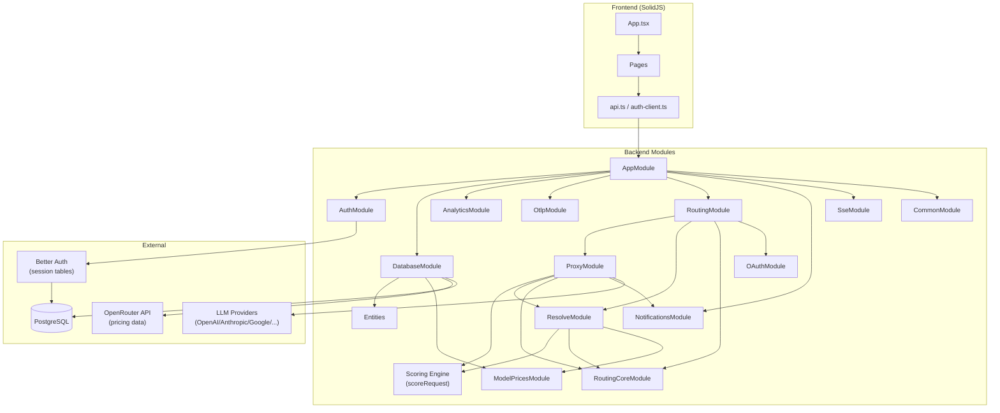

# Manifest — 程式碼地圖

## Annotated Directory Tree

```
manifest/                          ← Monorepo 根目錄
├── .changeset/                    ← Changesets 版本管理（只選 "manifest" 套件）
├── .github/
│   ├── assets/                    ← Logo、截圖（README 用）
│   └── workflows/
│       ├── ci.yml                 ← PR 測試：lint, typecheck, tests, coverage
│       ├── docker.yml             ← Docker 建置/發布（reusable workflow）
│       ├── release.yml            ← Merge 到 main 後自動發版
│       └── codeql.yml             ← GitHub CodeQL 安全掃描
├── docker/
│   ├── Dockerfile                 ← Multi-stage build（Node 22 Alpine）
│   ├── docker-compose.yml         ← manifest + postgres + ollama(optional)
│   ├── .env.example               ← Docker 環境變數範本
│   ├── install.sh                 ← 一鍵安裝腳本（curl | bash）
│   └── DOCKER_README.md           ← Self-hosting 完整指南
├── scripts/
│   └── check-api-prefix.js        ← CI 驗證：所有 API routes 必須有 /api/ 前綴
├── packages/
│   ├── shared/                    ← 共享 types/constants（後端+前端共用）
│   │   └── src/
│   │       ├── tiers.ts           ← Tier 類型（simple/standard/complex/reasoning）
│   │       ├── specificity.ts     ← SpecificityCategory 類型（9 個任務類別）
│   │       ├── agent-type.ts      ← AgentType 類型（支援的 agent 框架）
│   │       ├── resolve-response.ts ← ResolveResponse DTO
│   │       └── subscription/      ← 訂閱制 provider 設定（ChatGPT/MiniMax/Copilot）
│   │
│   ├── backend/                   ← NestJS API Server
│   │   ├── nest-cli.json          ← NestJS CLI 設定
│   │   ├── .env.example           ← 環境變數範本（最完整的參考）
│   │   └── src/
│   │       ├── main.ts            ← 🚪 伺服器入口：Helmet/CORS/BetterAuth/Body parser
│   │       ├── app.module.ts      ← Root Module（Guard chain: Session→ApiKey→Throttler）
│   │       ├── config/
│   │       │   └── app.config.ts  ← 所有 env var 的型別安全讀取
│   │       ├── auth/
│   │       │   ├── auth.instance.ts    ← ⭐ Better Auth singleton（在 NestJS 外初始化）
│   │       │   ├── session.guard.ts    ← Session 驗證 Guard（APP_GUARD #1）
│   │       │   └── current-user.decorator.ts ← @CurrentUser() param decorator
│   │       ├── database/
│   │       │   ├── database.module.ts  ← TypeORM 設定 + 47 個 migrations 清單
│   │       │   ├── database-seeder.service.ts ← SEED_DATA=true 時植入 demo 資料
│   │       │   ├── pricing-sync.service.ts    ← 每日從 OpenRouter 同步定價
│   │       │   ├── ollama-sync.service.ts     ← 同步 Ollama 本地模型
│   │       │   └── migrations/        ← 47 個 TypeORM migrations
│   │       ├── entities/              ← 17 個 TypeORM entities（資料庫表）
│   │       │   ├── agent-message.entity.ts   ← ⭐ 核心記錄表（每次 LLM 呼叫）
│   │       │   ├── tenant.entity.ts          ← 租戶（= 用戶資料邊界）
│   │       │   ├── agent.entity.ts           ← Agent（屬於 Tenant）
│   │       │   ├── agent-api-key.entity.ts   ← mnfst_* 格式的 OTLP key
│   │       │   ├── user-provider.entity.ts   ← 用戶連接的 LLM provider（加密 key）
│   │       │   ├── tier-assignment.entity.ts ← Agent 的 tier 設定
│   │       │   ├── specificity-assignment.entity.ts ← Specificity 路由設定
│   │       │   ├── notification-rule.entity.ts ← 告警規則（token/cost 閾值）
│   │       │   └── ...（其他輔助 entities）
│   │       ├── common/
│   │       │   ├── guards/
│   │       │   │   └── api-key.guard.ts     ← X-API-Key header Guard（APP_GUARD #2）
│   │       │   ├── constants/
│   │       │   │   └── providers.ts         ← ⭐ PROVIDER_REGISTRY（單一真相來源）
│   │       │   ├── utils/
│   │       │   │   ├── crypto.util.ts       ← AES-256-GCM 加解密
│   │       │   │   ├── hash.util.ts         ← scrypt KDF（API key 雜湊）
│   │       │   │   └── provider-aliases.ts  ← 從模型名稱推斷 provider
│   │       │   └── services/
│   │       │       ├── ingest-event-bus.service.ts ← RxJS Subject（訊息記錄後 emit）
│   │       │       └── manifest-runtime.service.ts ← 取得 baseUrl 等 runtime 資訊
│   │       ├── analytics/             ← Dashboard 分析 API
│   │       │   ├── controllers/       ← overview/tokens/costs/messages/agents
│   │       │   └── services/
│   │       │       ├── query-helpers.ts     ← ⭐ addTenantFilter / selectMessageRowColumns
│   │       │       ├── timeseries-queries.service.ts ← 時序資料查詢
│   │       │       └── messages-query.service.ts     ← 訊息列表查詢
│   │       ├── otlp/
│   │       │   ├── guards/
│   │       │   │   └── agent-key-auth.guard.ts ← mnfst_* key 驗證（含 5min 快取）
│   │       │   └── services/
│   │       │       └── api-key.service.ts   ← Agent onboarding（建立 tenant+agent+key）
│   │       ├── routing/               ← ⭐ LLM 路由核心
│   │       │   ├── proxy/
│   │       │   │   ├── proxy.controller.ts  ← POST /v1/chat/completions 入口
│   │       │   │   ├── proxy.service.ts     ← 路由主流程（evaluate → forward）
│   │       │   │   ├── anthropic-adapter.ts ← OpenAI → Anthropic 格式轉換
│   │       │   │   ├── google-adapter.ts    ← OpenAI → Gemini 格式轉換
│   │       │   │   ├── proxy-fallback.service.ts ← Fallback 邏輯
│   │       │   │   ├── proxy-message-recorder.ts ← 訊息記錄到 agent_messages
│   │       │   │   ├── session-momentum.service.ts ← Session tier 動量追蹤
│   │       │   │   └── proxy-rate-limiter.ts    ← Per-user 並發控制
│   │       │   ├── resolve/
│   │       │   │   └── resolve.service.ts   ← ⭐ 路由決策（specificity → scoring → tier）
│   │       │   ├── routing-core/
│   │       │   │   ├── tier.service.ts      ← Tier 設定 CRUD
│   │       │   │   ├── specificity.service.ts ← Specificity 設定 CRUD
│   │       │   │   ├── provider-key.service.ts ← Provider key 查詢 + 解密
│   │       │   │   └── tier-auto-assign.service.ts ← 模型品質評分 + tier 自動分配
│   │       │   └── oauth/             ← ChatGPT/Copilot/MiniMax OAuth flows
│   │       ├── scoring/               ← ⭐ 評分引擎（23 維度）
│   │       │   ├── index.ts           ← scoreRequest() 主函式
│   │       │   ├── config.ts          ← DEFAULT_CONFIG（維度 + 邊界 + 參數）
│   │       │   ├── keywords.ts        ← 所有 keyword 清單
│   │       │   ├── keyword-trie.ts    ← Aho-Corasick Trie 實作
│   │       │   ├── specificity-detector.ts ← Specificity 任務類型偵測
│   │       │   ├── momentum.ts        ← Session 動量計算
│   │       │   ├── sigmoid.ts         ← 分數 → tier 轉換 + confidence 計算
│   │       │   └── dimensions/        ← 各維度評分函式
│   │       ├── model-prices/          ← 模型定價（OpenRouter 快取）
│   │       ├── model-discovery/       ← 從 provider API 發現模型
│   │       ├── notifications/         ← 告警規則 + Email 通知
│   │       ├── sse/                   ← Server-Sent Events（Dashboard 即時更新）
│   │       ├── setup/                 ← 初始設定 wizard（/setup 頁面）
│   │       └── github/                ← GitHub star count API
│   │
│   ├── frontend/                  ← SolidJS SPA
│   │   ├── index.html             ← 前端入口（引用 self-hosted Boxicons）
│   │   ├── vite.config.ts         ← /api 和 /v1 proxy 到 backend :3001
│   │   └── src/
│   │       ├── App.tsx            ← 路由設定（SolidJS Router）
│   │       ├── components/        ← 60+ 共享 UI 元件
│   │       ├── pages/             ← 路由頁面元件
│   │       └── services/
│   │           ├── api.ts         ← 所有 API 呼叫函式（credentials: include）
│   │           ├── auth-client.ts ← Better Auth SolidJS client
│   │           └── providers.ts   ← Provider 定義 + Specificity stage 定義
│   │
│   └── manifest/                  ← 版本 shell（無程式碼）
│       ├── package.json           ← 版本號所在（canonical version）
│       └── CHANGELOG.md           ← 所有版本記錄
│
├── CLAUDE.md                      ← ⭐ 最詳盡的內部開發文件
├── CONTRIBUTING.md                ← 貢獻者指引
└── README.md                      ← 專案介紹
```

---

## 「我想改 X 要看哪裡？」速查表

| 我想要... | 看這裡 | 關鍵檔案 |
|-----------|--------|---------|
| **新增一個 LLM Provider** | 4 個地方 | `providers.ts`, `provider-model-fetcher.service.ts`, `provider-endpoints.ts`, `frontend/services/providers.ts` |
| **調整評分演算法** | `scoring/` | `config.ts`（維度/邊界）, `keywords.ts`（keyword 清單） |
| **新增 Specificity 任務類型** | 6 個地方 | `shared/specificity.ts`, `keywords.ts`, `config.ts`, `specificity-detector.ts`, `providers.ts` |
| **新增 API endpoint** | `analytics/controllers/` 或建新 module | `*.controller.ts`, `*.service.ts`, `app.module.ts` |
| **修改資料模型（加欄位）** | `entities/` + 產生 migration | `*.entity.ts` + `database.module.ts` |
| **修改 Dashboard 分析查詢** | `analytics/services/` | `timeseries-queries.service.ts`, `aggregation.service.ts` |
| **修改告警規則邏輯** | `notifications/services/` | `limit-check.service.ts`, `notification-rules.service.ts` |
| **修改認證邏輯** | `auth/` | `auth.instance.ts`, `session.guard.ts` |
| **修改代理轉發邏輯** | `routing/proxy/` | `proxy.service.ts`, `proxy-fallback.service.ts` |
| **修改 Anthropic/Google 格式轉換** | `routing/proxy/` | `anthropic-adapter.ts`, `google-adapter.ts` |
| **修改前端 UI 元件** | `frontend/src/components/` | 對應的 `*.tsx` 檔案 |
| **修改前端路由** | `frontend/src/` | `App.tsx`, `pages/` |
| **修改 Docker 部署** | `docker/` | `Dockerfile`, `docker-compose.yml` |
| **修改環境變數** | `config/app.config.ts` | 加入新的 env var 讀取 |
| **修改 CI/CD** | `.github/workflows/` | `ci.yml`, `docker.yml`, `release.yml` |
| **新增支援的 Agent 類型** | 3 個地方 | `shared/agent-type.ts`, `FrameworkSnippets.tsx`, `AgentTypeGrid.tsx` |

---

## 模組依賴關係圖



---

## 注意事項

1. **`auth.instance.ts` 的初始化時機**：在 NestJS 模組載入前執行，必須用 `NODE_OPTIONS='-r dotenv/config'` 預載 dotenv
2. **Provider Registry 是唯一真相**：永遠從 `common/constants/providers.ts` 引用 provider ID，不要在其他地方硬編碼
3. **Message 記錄必須通過 `selectMessageRowColumns()`**：確保前端 MessageTable 元件所需的所有欄位都被 SELECT
4. **API 路由前綴強制**：`scripts/check-api-prefix.js` 會在 CI 驗證所有路由使用 `/api/` 前綴
5. **100% 測試覆蓋率**：每個新檔案都需要對應的 `.spec.ts` 且覆蓋所有分支
