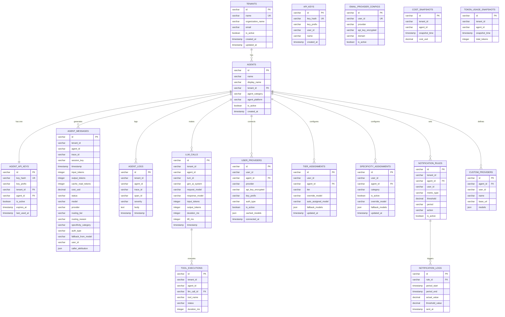

# DATA_MODEL.md — Manifest 資料模型文件

> 最後更新：2026-04-20
> 版本：依據 48 個 TypeORM migration 與 15 個 entity 分析產出

---

## 1. 多租戶資料模型層級關係

Manifest 採用三層多租戶架構，每個 User（由 Better Auth 管理）擁有一個 Tenant，每個 Tenant 可建立多個 Agent，每個 Agent 持有一把 OTLP ingest key。

```
User（Better Auth 管理，儲存於 better_auth_users 等表）
  │
  └──► Tenant（tenants 表，name = user.id）
         │
         └──► Agent（agents 表，[tenant_id, name] 唯一約束）
                │
                ├──► AgentApiKey（agent_api_keys 表，OneToOne）
                │     └── mnfst_* 格式 key，用於 OTLP / proxy 認證
                │
                ├──► UserProvider（user_providers 表）
                │     └── LLM provider API key（AES-256-GCM 加密）
                │
                ├──► TierAssignment（tier_assignments 表）
                │     └── Complexity routing 設定（simple/standard/complex/reasoning）
                │
                ├──► SpecificityAssignment（specificity_assignments 表）
                │     └── Task-type routing 設定（9 個類別）
                │
                ├──► NotificationRule（notification_rules 表）
                │     └── Token / Cost 閾值告警規則
                │
                └──► AgentMessage（agent_messages 表）
                      └── 每次 LLM proxy 呼叫的完整 telemetry 記錄
```

**Tenant 建立時機**：使用者首次建立 Agent 時，`ApiKeyGeneratorService.onboardAgent()` 在單一 transaction 中建立 Tenant + Agent + AgentApiKey。

---

## 2. 核心 Entity 清單

| Entity 類別名稱 | 資料表名稱 | 主要用途 | 關鍵欄位 |
|----------------|-----------|---------|---------|
| `Tenant` | `tenants` | 多租戶根節點 | `id`、`name`（= user.id）、`is_active` |
| `Agent` | `agents` | AI Agent 實體 | `id`、`name`、`tenant_id`、`is_active` |
| `AgentApiKey` | `agent_api_keys` | OTLP / proxy 認證 key | `key_hash`（scrypt）、`key_prefix`（12字元）、`agent_id`（OneToOne） |
| `ApiKey` | `api_keys` | 後台 X-API-Key 程式化存取 | `key_hash`、`key_prefix`、`user_id` |
| `AgentMessage` | `agent_messages` | LLM proxy 每次呼叫記錄 | `tenant_id`、`agent_id`、`model`、`routing_tier`、`cost_usd`、`timestamp` |
| `AgentLog` | `agent_logs` | OTLP span/trace 原始日誌 | `trace_id`、`span_id`、`severity`、`body` |
| `LlmCall` | `llm_calls` | LLM 呼叫細節（OTLP） | `turn_id`、`gen_ai_system`、`input_tokens`、`output_tokens`、`ttft_ms` |
| `ToolExecution` | `tool_executions` | Agent 工具呼叫記錄 | `tool_name`、`llm_call_id`、`status`、`duration_ms` |
| `UserProvider` | `user_providers` | LLM Provider 連線設定 | `provider`、`api_key_encrypted`（AES-256-GCM）、`auth_type`、`cached_models`（JSONB） |
| `TierAssignment` | `tier_assignments` | Complexity routing 分配 | `tier`（simple/standard/complex/reasoning）、`override_model`、`fallback_models` |
| `SpecificityAssignment` | `specificity_assignments` | Task-type routing 分配 | `category`（9 種）、`is_active`、`override_model`、`fallback_models` |
| `NotificationRule` | `notification_rules` | 告警規則設定 | `metric_type`（tokens/cost）、`threshold`、`period`、`action` |
| `NotificationLog` | `notification_logs` | 已送出告警記錄 | `rule_id`、`period_start`（唯一約束防重送） |
| `EmailProviderConfig` | `email_provider_configs` | Email 發送 provider 設定 | `provider`（resend/mailgun/sendgrid）、`api_key_encrypted` |
| `CustomProvider` | `custom_providers` | 自訂 LLM endpoint | `base_url`、`models`（JSONB）、`agent_id` |
| `CostSnapshot` | `cost_snapshots` | 成本時序快照 | `cost_usd`、`snapshot_time`、`agent_id` |
| `TokenUsageSnapshot` | `token_usage_snapshots` | Token 時序快照 | `input_tokens`、`output_tokens`、`total_tokens`、`snapshot_time` |

---

## 3. ER Diagram（Mermaid）



---

## 4. 資料隔離機制

### 雙層過濾保護

所有分析查詢均透過 `addTenantFilter()` helper（位於 `packages/backend/src/analytics/services/query-helpers.ts`）套用 WHERE 條件，實現多租戶資料隔離。

```typescript
// query-helpers.ts — 單一函式控制所有分析查詢的 tenant 過濾
addTenantFilter(qb, userId, agentName?, tenantId?)
  → WHERE am.user_id = :userId      // 第一層：user-level 隔離
  → AND am.tenant_id = :tenantId    // 第二層：tenant-level 加強（可選）
  → AND am.agent_name = :agentName  // Agent 層過濾（單 agent 報表用）
```

**關鍵設計原則**：
- `agent_messages` 同時儲存 `user_id` 與 `tenant_id`，兩個欄位都可獨立作為過濾條件
- `@CurrentUser()` decorator 從 Better Auth session 中取得 `user.id`，作為查詢參數傳入
- `addTenantFilter()` 是所有分析端點的強制入口，不可繞過
- `query-helpers.spec.ts` 中的測試會驗證所有必要欄位別名，防止 projection 漂移

### Agent Key 認證流程中的隔離

`AgentKeyAuthGuard` 驗證 Bearer token 後，將 `{ tenantId, agentId, agentName, userId }` 附加到 `request.ingestionContext`，後續 proxy 服務透過此 context 將所有寫入綁定到正確的 tenant。

---

## 5. 重要索引策略

### agent_messages 複合索引設計

`agent_messages` 是系統中寫入量最大的資料表，設計了 7 個複合索引以支援各類查詢模式：

```typescript
@Index(['tenant_id', 'agent_id', 'timestamp'])   // 1. 單一 agent 時序查詢（Overview per-agent）
@Index(['user_id', 'timestamp'])                  // 2. 用戶全局時序查詢（跨 agent 統計）
@Index(['tenant_id', 'agent_name', 'timestamp'])  // 3. 按名稱查詢（agent 可能更名，需 name + time）
@Index(['tenant_id', 'timestamp'])                // 4. Tenant 層時序（不限 agent 的 dashboard 查詢）
@Index(['tenant_id', 'trace_id'])                 // 5. Trace 關聯查詢（span 鏈路追蹤）
@Index(['tenant_id', 'model'])                    // 6. 按模型聚合（Model Prices 頁面）
@Index(['tenant_id', 'agent_id', 'status'])       // 7. 狀態過濾（錯誤率分析）
```

**設計原因**：
- 所有查詢以 `tenant_id` 為前置條件，確保索引選擇性最高
- `timestamp` 總是作為索引尾欄位，支援 `ORDER BY timestamp DESC LIMIT N` 的高效執行
- 索引 3 額外用 `agent_name` 是因為 dashboard 的 Recent Activity 依 agent_name 過濾，且 agent 有更名功能
- `trace_id` 索引專為 OTLP 日誌關聯設計，支援 span 追蹤功能

### 其他關鍵索引

| 資料表 | 索引 | 用途 |
|-------|------|------|
| `agents` | `[tenant_id, name] UNIQUE` | 同一 Tenant 下 Agent 名稱唯一 |
| `agent_api_keys` | `key_hash UNIQUE` | 快速 key 驗證，防碰撞 |
| `api_keys` | `key_hash UNIQUE` | 後台 API key 驗證 |
| `user_providers` | `[agent_id, provider, auth_type] UNIQUE` | 一個 Agent 對同一 provider 只能連一種 auth 方式 |
| `tier_assignments` | `[agent_id, tier] UNIQUE` | 每個 tier 只有一筆設定 |
| `specificity_assignments` | `[agent_id, category] UNIQUE` | 每個 category 只有一筆設定 |
| `notification_logs` | `[rule_id, period_start] UNIQUE` | 防止同一規則在同一週期重複送出告警 |
| `email_provider_configs` | `user_id UNIQUE` | 每個用戶只能設定一個 email provider |

---

## 6. 敏感資料加密機制

### Provider API Keys — AES-256-GCM 對稱加密

**適用欄位**：
- `user_providers.api_key_encrypted` — LLM provider keys（OpenAI、Anthropic 等）
- `email_provider_configs.api_key_encrypted` — Email provider keys（Resend、Mailgun 等）

**實作位置**：`packages/backend/src/common/utils/crypto.util.ts`

```
加密流程：
  plaintext API key
    → AES-256-GCM（隨機 IV + 隨機 auth tag）
    → Base64 encoded ciphertext
    → 儲存至 *_encrypted 欄位

解密流程（僅在實際 proxy 呼叫時執行）：
  ciphertext
    → AES-256-GCM 解密
    → plaintext API key（用於 HTTP 請求後即丟棄）
```

**安全設計**：
- `key_prefix` 欄位儲存明文 key 的前 12 字元，用於 UI 顯示（讓用戶識別已連接的 key）
- 解密操作僅在 `ProviderKeyService.getProviderApiKey()` 中執行，不快取解密結果
- 加密 key 由 `BETTER_AUTH_SECRET` 或專用 encryption key 衍生

### Agent API Keys — scrypt KDF 單向雜湊

**適用欄位**：
- `agent_api_keys.key_hash` — OTLP / proxy 認證 key（`mnfst_*` 格式）
- `api_keys.key_hash` — 後台程式化存取 key

**實作位置**：`packages/backend/src/common/utils/hash.util.ts`

```
Key 生成流程（僅執行一次）：
  crypto.randomBytes() → mnfst_{random}
    → scrypt KDF（salt + N/r/p 參數）
    → key_hash（128字元 hex）
    → 儲存 key_hash + key_prefix（前12字元）
    → 明文 key 僅在建立時回傳給用戶，後不再存取

驗證流程（每次認證請求）：
  Bearer token → scrypt hash → timing-safe compare → key_hash
```

**安全設計**：
- `AgentKeyAuthGuard` 先以 `key_prefix` 快速縮小候選範圍，再進行 scrypt 驗證
- 驗證結果快取 5 分鐘（in-memory），避免每請求都執行昂貴的 scrypt 運算
- `key` 欄位在正式環境為 `null`（建立後即清除）

---

## 7. Migration 機制

### 總覽

| 項目 | 數值 |
|------|------|
| Migration 檔案總數（含 spec） | 67 |
| 實際 migration 檔案數（不含 spec） | 48 |
| 管理位置 | `packages/backend/src/database/migrations/` |
| 執行方式 | 應用啟動時自動執行（`migrationsRun: true`） |
| Schema sync | 永久停用（`synchronize: false`） |

### 命名規範

所有 migration 以 Unix timestamp 毫秒為前綴，確保執行順序：

```
1771464895790-InitialSchema.ts          ← 初始 schema 建立
1771500000000-HashApiKeys.ts            ← API key 加密改版
1771900000000-EncryptApiKeys.ts         ← Provider key AES 加密
...
1775600000000-AddMessageFeedback.ts     ← 最新功能追加
```

### 開發工作流

```bash
# 1. 修改 entity 檔案（packages/backend/src/entities/*.entity.ts）

# 2. 產生 migration（TypeORM 自動 diff）
cd packages/backend
npm run migration:generate -- src/database/migrations/DescriptiveName

# 3. 在 database.module.ts 的 migrations 陣列中匯入新檔案

# 4. 提交 entity + migration 兩個檔案
```

**注意事項**：
- 永遠不重用已存在的 timestamp，新 migration 必須使用唯一時間戳
- `datasource.ts` 是 CLI 專用的 DataSource，與 NestJS 執行時的 DataSource 分離
- Better Auth 的資料表（users、sessions 等）由 Better Auth 內部的 `ctx.runMigrations()` 管理，不在 TypeORM migration 範疇內
- E2E 測試的 entity 清單在 `packages/backend/test/helpers.ts` 中維護，新增 entity 時需同步更新

### Migration 涵蓋的主要演進

| 階段 | 主要變更 |
|------|---------|
| 初始建置 | tenants、agents、agent_api_keys、agent_messages 基礎 schema |
| 安全強化 | API keys scrypt hash、Provider keys AES-256-GCM 加密 |
| 路由功能 | tier_assignments、specificity_assignments 表建立 |
| 告警功能 | notification_rules、notification_logs、email_provider_configs |
| Telemetry | llm_calls、tool_executions、agent_logs 欄位擴充 |
| 分析增強 | cost_snapshots、token_usage_snapshots 快照表 |
| 最新功能 | caller_attribution（Agent 類型識別）、message feedback 欄位 |
